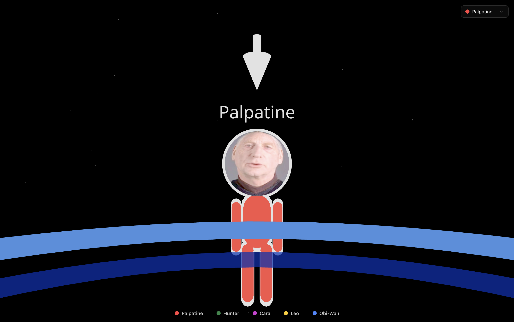
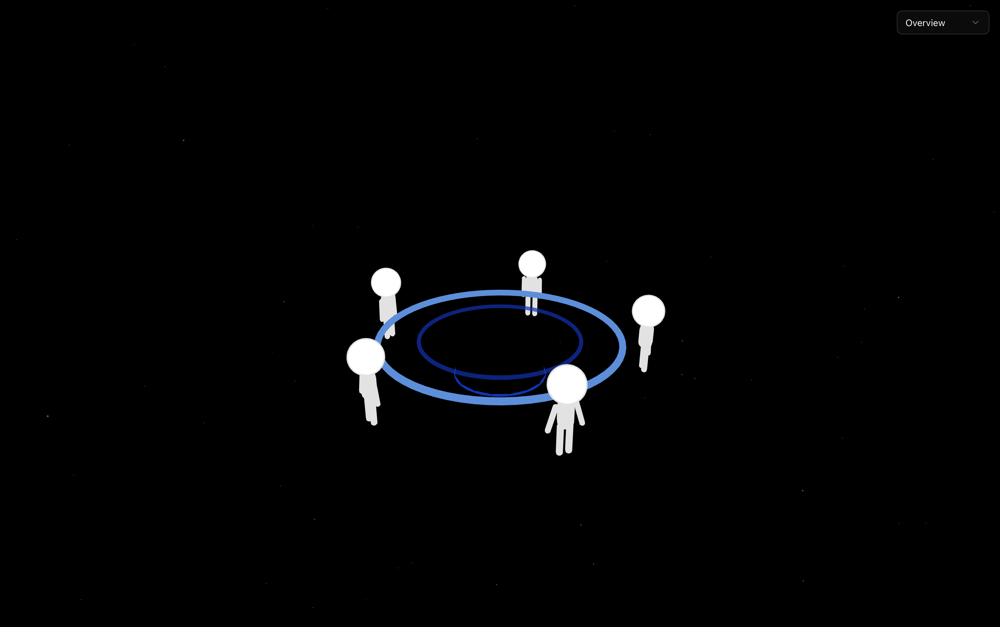

# Vibe Council

> Built as a quick three-hour hackathon prototype

Vibe Council lets you sit at a virtual table with several characters at once. You talk into your mic, and a council of agents listen, answer, and bounce off each other in real time.




## Quickstart

Create a `.env` file with your Anam key:

```env
ANAM_API_KEY=your_anam_api_key_here
```

Install dependencies and run the dev server:

```bash
pnpm install
pnpm dev
```

Then open `http://localhost:3000` in your browser.

## Project Structure

```text
app/
  page.tsx              # Main UI
  api/anam/             # Anam session-token API route
components/
  anam-persona.tsx      # Anam avatar wrapper
  three/                # 3D scene (table, circle of figures)
lib/
  anam-personas.ts      # Persona definitions
  utils.ts              # Misc utilities
```
