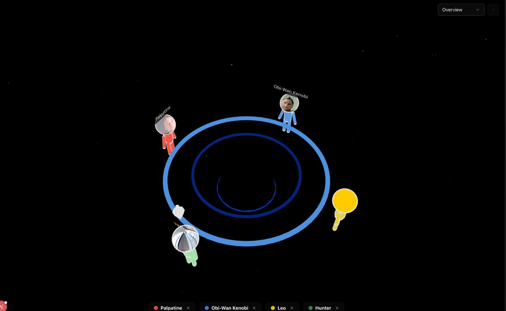

# Vibe Council

**Vibe Council** is an interactive, AI-powered group chat experience where you join a council of AI agents with distinct personalities. Engage in discussions, debates, or casual chats with agents who listen, respond, and interact with you and each other in real-time.



## 🌟 Features

- **Diverse AI Personas**: Interact with unique characters like "Palpatine", "Obi-Wan", and more.
- **Real-time Audio**: Speak naturally to the council using your microphone. The agents listen and respond with synthesized speech.
- **3D Visuals**: Immersive 3D circle scene visualization using React Three Fiber.
- **Realistic Avatars**: Powered by **Anam.ai** for lifelike agent appearances and lip-syncing.
- **Smart Moderation**: An automated moderator system manages turn-taking to ensure a smooth conversation flow.
- **Scenario Selection**: Choose from various scenarios like "Life Decisions", "Career Advice", "Friendly Debate", or create your own.

## 🛠️ Tech Stack

- **Framework**: [Next.js 16](https://nextjs.org/) (App Router)
- **UI Library**: [React 19](https://react.dev/)
- **Styling**: [Tailwind CSS](https://tailwindcss.com/)
- **3D Graphics**: [React Three Fiber](https://docs.pmnd.rs/react-three-fiber) / [Three.js](https://threejs.org/)
- **AI Avatars**: [Anam.ai SDK](https://anam.ai/)
- **Icons**: [Lucide React](https://lucide.dev/)
- **Components**: [Radix UI](https://www.radix-ui.com/)

## 🚀 Getting Started

### Prerequisites

- **Node.js**: Version 18 or higher.
- **Anam.ai API Key**: You need an API key from [Anam.ai](https://anam.ai/) to power the AI avatars.

### Installation

1.  **Clone the repository:**

    ```bash
    git clone https://github.com/yourusername/vibe-council.git
    cd vibe-council
    ```

2.  **Install dependencies:**

    ```bash
    npm install
    # or
    yarn install
    # or
    pnpm install
    ```

3.  **Configure Environment Variables:**

    Create a `.env` file in the root directory and add your Anam.ai API key:

    ```env
    ANAM_API_KEY=your_anam_api_key_here
    ```

4.  **Run the Development Server:**

    ```bash
    npm run dev
    ```

5.  **Open the App:**

    Visit [http://localhost:3000](http://localhost:3000) in your browser.

## 📖 Usage

1.  **Enter Your Name**: Start by entering your name so the agents know who you are.
2.  **Select a Scenario**: Choose a topic for the council to discuss (e.g., "Career Advice") or type a custom one.
3.  **Choose Council Members**: Select up to 6 agents to join the council.
4.  **Start Meeting**: Click "Start Council Meeting".
5.  **Initialize Audio**: Grant microphone permissions when prompted.
6.  **Interact**:
    - **Speak**: Just talk! The agents will listen.
    - **Focus**: Click on an agent to "focus" them, giving them the floor.
    - **Listen**: The agents will take turns speaking based on the conversation flow.

## 📂 Project Structure

- `app/`: Next.js App Router pages and API routes.
  - `api/anam/`: API routes for Anam.ai session token generation.
  - `page.tsx`: Main application logic and UI.
- `components/`: Reusable React components.
  - `Council.tsx`: Core logic for the council interaction.
  - `AnamPersona.tsx`: Component for rendering individual Anam.ai avatars.
  - `three/`: 3D scene components.
- `lib/`: Utility functions and constants (e.g., persona definitions).
- `public/`: Static assets.
